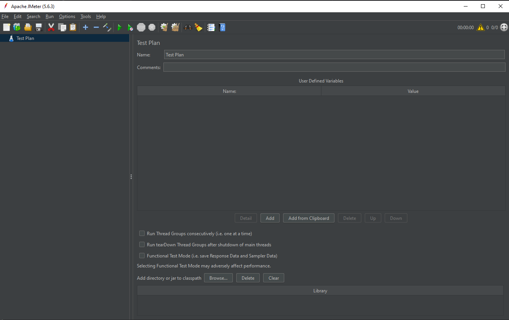
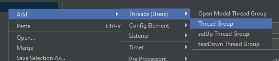

# Lesson 1: Introduction to JMeter and Basic Setup

## Goal
The goal of this lesson is to introduce JMeter and guide you through the basic setup process, including starting JMeter and adding a Thread Group to your Test Plan.

## Steps

### 1.1. Starting JMeter

1. **Download and Install JMeter**
    - Visit the [official JMeter website](https://jmeter.apache.org/download_jmeter.cgi) and download the latest version.
    - Extract the downloaded archive.
    - Navigate to the `bin` directory and start JMeter by running the `jmeter.bat` file (Windows) or `jmeter.sh` (macOS/Linux).

### 1.2. Adding a Thread Group

1. **Creating a Test Plan**
    - Open JMeter.
    - Right-click on the **Test Plan** node.
       
   
    - Select **Add > Threads (Users) > Thread Group**.
       

---    
# [Next: Setting Up HTTP Test Script Recorder](setting-up-http-test-script-recorder.md)
