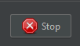

# 第5课：记录和管理HTTP请求

## 目标
本课的目标是通过浏览Web应用程序记录HTTP请求，并在JMeter中管理记录的请求。

## 步骤

### 5.1. 记录HTTP请求
1. **浏览应用程序**
   - 以通常的方式浏览您的Web应用程序。JMeter将记录HTTP请求。

### 5.2. 停止录制
1. **停止代理服务器**
   - 返回到JMeter，并在**HTTP(S) Test Script Recorder**窗口中单击**停止**按钮。
      
   - 在浏览器中禁用代理设置，以恢复直接的互联网访问。

---

# [下一步：组织记录的请求](organizing-recorded-requests.md)