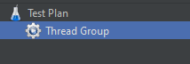
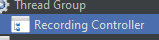
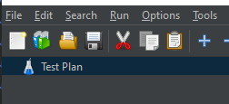
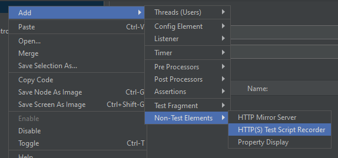

# 第2课：设置HTTP(S)测试脚本记录器

## 目标
本课的目标是指导您在JMeter中设置HTTP(S)测试脚本记录器，包括添加Recording Controller和配置Proxy服务器。

## 步骤

### 2.1. 添加Recording Controller
1. **添加到线程组**
   - 右键单击**线程组**。
      

   - 选择**添加 > 逻辑控制器 > Recording Controller**。
      

### 2.2. 添加Proxy服务器
1. **配置代理**
   - 右键单击**工作台**节点。
      
   - 选择**添加 > 非测试元件 > HTTP(S)测试脚本记录器**。
      

---

# [下一步：配置和使用代理服务器](configuring-and-using-the-proxy-server.md)