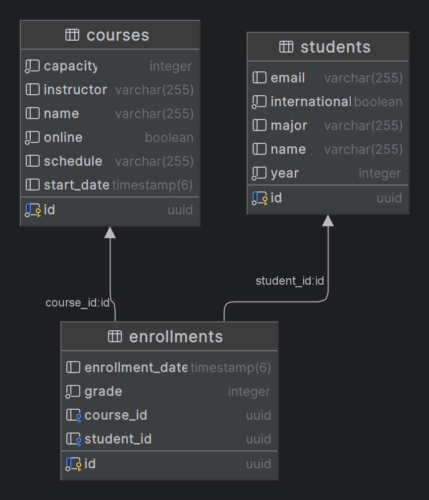

# 定义实体关系

## 介绍

本指南深入探讨了在使用JPA（Java Persistence API）的Spring Boot项目中理解和实现实体之间的关系。具体来说，我们将探讨 `Enrollment` 实体与其关联实体 `Student` 和 `Course` 之间的关系。

## 目标

本指南的目标是提供清晰的说明，以便在使用JPA的Spring Boot项目中定义和理解实体关系。通过本指南，您将了解如何在应用程序中建立实体之间的关联并加以实现。

## 实体关联



### Enrollment 实体特征：

- `id`（UUID）：实体的主键。
- `student`（Student）：与注册关联的学生。
- `course`（Course）：与注册关联的课程。
- `enrollmentDate`（日期）：注册日期。
- `grade`（整数）：课程中获得的成绩。

#### 学生关系

`Enrollment` 实体与 `Student` 实体之间的关系代表了一个场景，即学生在课程中注册。这是一种多对一的关系，一个学生可以与多个注册相关联。要建立这种关系，在 `Enrollment` 实体中的 `student` 属性上使用 `@ManyToOne` 进行注解。

```java
@ManyToOne
@JoinColumn(name = "student_id")
private Student student;
```

#### 课程关系

同样，`Enrollment` 实体与 `Course` 实体之间的关系表示了多个学生注册了一个课程的场景。这也是一种多对一的关系，一个课程可以与多个注册相关联。在 `Enrollment` 实体中的 `course` 属性上进行注解，使用 `@ManyToOne`。

```java
@ManyToOne
@JoinColumn(name = "course_id")
private Course course;
```

---

# [下一步：获取策略](fetching.md)