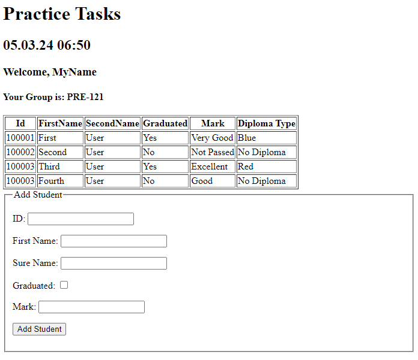

# 片段和布局

**描述:**

在这一部分中，我们将实现 Thymeleaf 片段和布局。我们将更新现有视图以包含片段，然后创建一个新的视图来利用这些片段。

## **步骤:**

1. **在 `first.html` 中添加一个片段:**

   - 打开 `practice` 目录中的 `first.html` 文件。
   - 在 `<body>` 标签内的 `<div>` 中添加 `th:fragment` 属性:

     ```html
     <!-- practice/first.html -->
     <html lang="en" xmlns:th="http://www.thymeleaf.org">
     <head>
         <!-- 其他 head 元素... -->
     </head>
     <body>
         <!-- 更新: 在 'div' 中添加 'th:fragment' 属性 -->
         <div th:fragment="info">
             <p>这是第一个视图的信息部分。</p>
         </div>
         <!-- 其他内容... -->
     </body>
     </html>
     ```

2. **在 `second.html` 中添加一个片段:**

   - 打开 `practice` 目录中的 `second.html` 文件。
   - 在 `<body>` 标签内的 `<table>` 中添加 `th:fragment` 属性:

     ```html
     <!-- practice/second.html -->
     <html lang="en" xmlns:th="http://www.thymeleaf.org">
     <head>
         <!-- 其他 head 元素... -->
     </head>
     <body>
         <!-- 更新: 在 'table' 中添加 'th:fragment' 属性 -->
         <table border="1" th:fragment="students-table">
             <thead>
             <tr>
                 <th>Id</th>
                 <th>FirstName</th>
                 <th>SecondName</th>
                 <th>Graduated</th>
                 <th>Mark</th>
                 <th>Diploma Type</th>
             </tr>
             </thead>
             <tbody>
             <!-- 学生数据将插入到这里 -->
             </tbody>
         </table>
         <!-- 其他内容... -->
     </body>
     </html>
     ```

3. **在 `third.html` 中添加一个片段:**

   - 打开 `practice` 目录中的 `third.html` 文件。
   - 在 `<body>` 标签内的 `<fieldset>` 中添加 `th:fragment` 属性:

     ```html
     <!-- practice/third.html -->
     <html lang="en" xmlns:th="http://www.thymeleaf.org">
     <head>
         <!-- 其他 head 元素... -->
     </head>
     <body>
         <!-- 更新: 在 'fieldset' 中添加 'th:fragment' 属性 -->
         <fieldset th:fragment="add-student-form">
             <legend>添加学生</legend>

             <div th:if="${param.addedStudent}">
                 <p style="color: green;">学生添加成功！</p>
             </div>

             <form action="#" th:action="@{/addStudent}" th:object="${model}" method="post">
                <!-- 其他表单元素... -->
             </form>
         </fieldset>
         <!-- 其他内容... -->
     </body>
     </html>
     ```

4. **创建一个带有片段的 `fourth.html` :**

   - 在 `practice` 目录中创建一个名为 `fourth.html` 的新文件。
   - 使用 `th:insert` 和 `th:replace` 属性来包含其他视图中的片段:

     ```html
     <!-- practice/fourth.html -->
     <html lang="en" xmlns:th="http://www.thymeleaf.org">
     <head>
         <!-- 其他 head 元素... -->
     </head>
     <body>
         <!-- 更新: 插入 'first.html' 中的 'info' 片段 -->
         <div th:insert="~{practice/first :: info}"></div>

         <!-- 更新: 替换 'second.html' 中的 'students-table' 片段 -->
         <div th:replace="~{practice/second :: students-table}"></div>

         <!-- 更新: 插入 'third.html' 中的 'add-student-form' 片段 -->
         <div th:insert="~{practice/third :: add-student-form}"></div>
         <!-- 其他内容... -->
     </body>
     </html>
     ```

   - 解释:
      - `th:insert` 用于将指定片段（`info` 和 `add-student-form`）的内容包含在 `fourth.html` 文件中。
      - `th:replace` 用于在 `fourth.html` 文件中替换指定片段（`students-table`）的内容。

## 结果
您的视图应如下所示:



---

# 恭喜！ 您已完成所有任务。现在让我们转到 **[实验室任务](../lab-work.md#lab-work-tasks)**