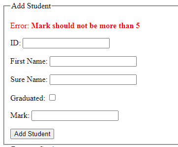

# 查询参数和验证

**描述:**

在这个继续中，我们将探讨使用查询参数在视图中显示处理表单提交后的消息。这涉及调整 `thirdView` 来根据查询参数显示成功和错误消息。

**步骤:**

1. **调整视图（thirdView.html）:**

   - 打开 `third.html` 文件，并添加显示成功和错误消息的部分:

     ```html
     <!DOCTYPE html>
     <html lang="en" xmlns:th="http://www.thymeleaf.org">
     <head>
         <!-- 其他 head 元素... -->
     </head>
     <body>
         <!-- 其他 body 元素... -->

         <div th:if="${param.addedStudent}">
             <p style="color: green;">学生添加成功！</p>
         </div>

         <div th:if="${param.error}">
             <p style="color: red;">错误: <strong th:text="${param.error}"></strong></p>
         </div>

         <!-- 其他内容... -->
     </body>
     </html>
     ```

   - 说明:
      - `<div th:if="${param.error}">` 检查URL中是否存在查询参数 `error`。
      - 如果参数存在，则以红色显示来自 `${param.error}` 的错误消息。

2. **处理表单提交并进行额外验证（PracticeController）:**

   - 更新 `PracticeController` 中的 `addStudent` 方法，使用 `if-else` 结构包含对学生分数的额外验证:

     ```java
     import org.springframework.stereotype.Controller;
     import org.springframework.ui.Model;
     import org.springframework.web.bind.annotation.*;

     import java.util.ArrayList;
     import java.util.List;

     @Controller
     public class PracticeController {

         private final List<StudentModel> students = new ArrayList<>();

         // 其他方法...

         @PostMapping("/addStudent")
         public String addStudent(@ModelAttribute("model") StudentModel model) {
             // 额外验证: 检查分数是否超过5分。
             if (model.getMark() > 5) {
                 // 如果分数超过5分，重定向并显示错误消息。
                 return "redirect:/third?error=分数不能超过5分";
             } else {
                 students.add(model);

                 return "redirect:/third?addedStudent=true";
             }
         }
     }
     ```

## 结果
您的视图应如下所示:





---

# [下一个任务: *片段和布局*](fragments-and-layouts.md)