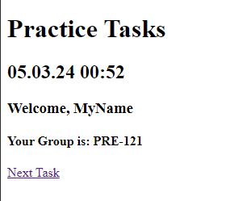

# 处理变量

**描述:**

在这个任务中，你将探索和利用 Thymeleaf 视图中的不同类型的局部变量，在你的 Spring 应用程序中。这些包括在视图本身中定义的变量，从控制器传递的变量，本地化的属性文件中定义的变量，以及在 Thymeleaf 配置类中定义的静态变量。

## **步骤:**

1. **在 Thymeleaf 视图中定义局部变量:**
    - 打开你的 Thymeleaf 视图文件（例如 `first.html`）。
    - 探索直接在视图中定义的局部变量的使用。
    - 在提供的示例代码中:

       ```html
       <head th:with="title='首页'">
           <meta charset="UTF-8">
           <title th:text="${title}">标题</title>
       </head>
       ```

      局部变量 `title` 是在 HTML 的 `<head>` 部分内定义的。

2. **从属性文件中获取本地化变量:**
    - 查看 Thymeleaf 配置类中 `MessageSource` bean 的配置:

       ```java
       @Bean
       public MessageSource messageSource() {
           ReloadableResourceBundleMessageSource messageSource = new ReloadableResourceBundleMessageSource();
           messageSource.addBasenames("classpath:local/practice");
           messageSource.setDefaultEncoding("UTF-8");
 
           return messageSource;
       }
       ```
    - 在路径 `/src/main/resources/local/` 下创建一个 `practice.properties` 文件，并添加以下内容:

          ```properties
          student.name=我的名字
          student.group=PRE-121
          message.welcome=欢迎，{0}
          message.info=你的小组是: {0}
          ```
   **关于 `{0}` 的说明:**
    - 本地化消息中的符号 `{0}` 表示一个占位符变量。当消息被渲染时，占位符 `{0}` 会被提供的实际值替换。例如，在消息 `欢迎，{0}` 中，`{0}` 将被变量的实际值替换，比如一个名字。

    - 使用 `#{}` 语法在 Thymeleaf 视图中探索本地化变量的用法。
    - 在提供的示例代码中:

       ```html
       <h3 th:utext="#{message.welcome(#{student.name})}"></h3>
       <h4 th:utext="#{message.info(#{student.group})}"></h4>
       ```

      变量 `student.name`，`student.group`，`message.welcome` 和 `message.info` 都实现了这个想法。

3. **在 Thymeleaf 配置类中添加静态变量:**
    - 在你的 Thymeleaf 配置类中，使用 `addStaticVariable` 方法添加静态变量:

       ```java
       @Bean
       public ViewResolver thymeleafViewResolver() {
           ThymeleafViewResolver resolver = new ThymeleafViewResolver();
           resolver.addStaticVariable("projectName", "练习任务");
           resolver.addStaticVariable("currentDateTime", LocalDateTime.now());
           resolver.setTemplateEngine(templateEngine());
 
           return resolver;
       }
       ```

    - 使用 `#vars` 语法在 Thymeleaf 视图中访问这些静态变量。
    - 在提供的示例代码中:

       ```html
             <h1 th:utext="${#vars.projectName}">项目名称</h1>
             <h2 th:utext="${#temporals.format(#vars.currentDateTime, 'dd.MM.yy HH:mm')}">当前日期和时间</h2>
       ```

## 结果

现在你的页面应该如下所示:



---

# [下一个任务: *变量和控制器*](variables-and-controller.md)