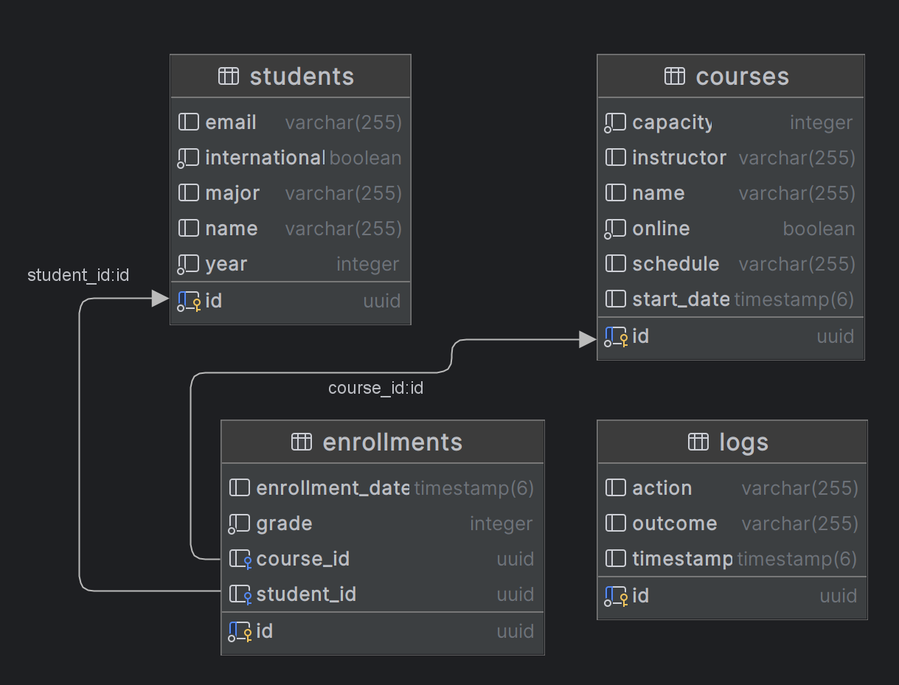

# 第一课：创建实体和存储库

## 目标

本任务的目标是在使用Spring Data JPA的Spring Boot项目中定义核心实体（Student、Course、Enrollment、Log）并设置相应的存储库。

## 步骤

1. **参考提供的ER图来定义实体类。**
   
   如果您已根据提供的ER图有实体类，请继续执行步骤2。否则，请分析ER图并创建以下实体类：

   - Student（学生）
   - Course（课程）
   - Enrollment（注册）
   - Log（日志）

   确保每个实体类包含ER图中所示的必要属性。

2. **为实体创建存储库。**

   例如，让我们为 `Student` 实体创建存储库：

   ```java
   package com.example.demo.repository;

   import com.example.demo.entity.Student;
   import org.springframework.data.jpa.repository.JpaRepository;

   public interface StudentRepository extends JpaRepository<Student, UUID> {
   }
   ```

   如果您已经有了实体存储库，请继续下一步。否则，重复上述步骤为其他实体（Course、Enrollment、Log）创建存储库。

---

# [下一步：实现基本事务操作](basic-transactional-operations.md)