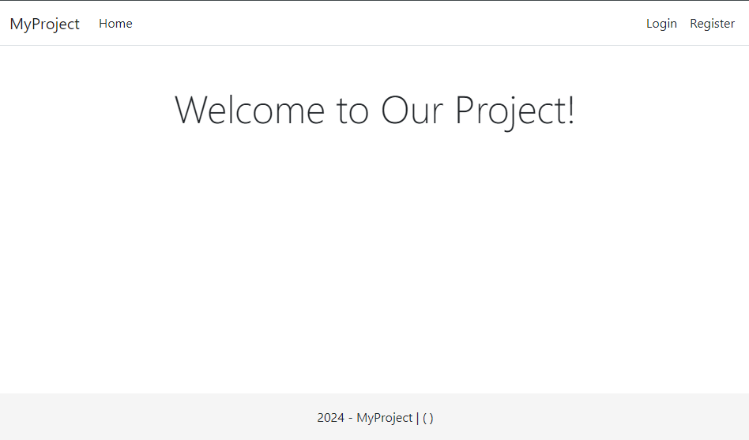
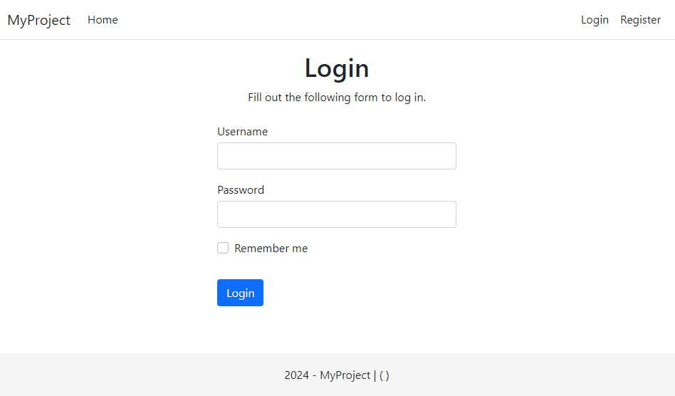
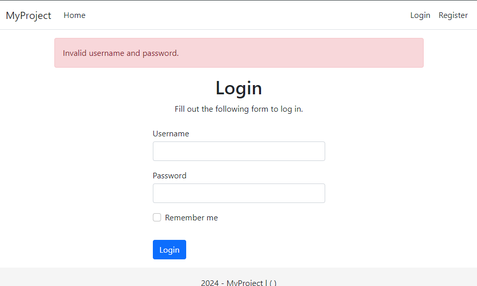
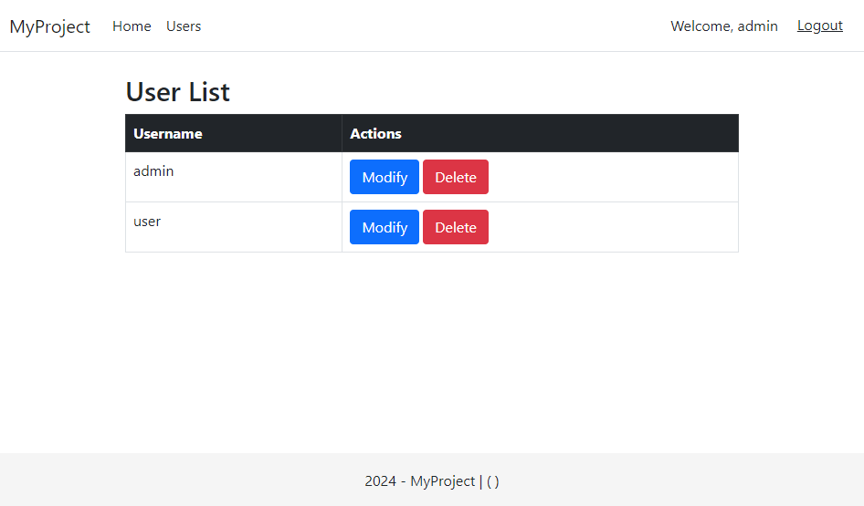
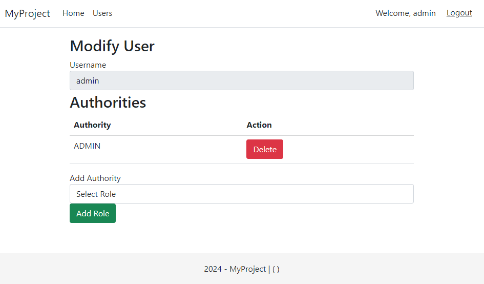

# Thymeleaf Lab Work

Welcome to the Thymeleaf Lab Work! The goal of this series of tasks is to help you practice and master Thymeleaf, a powerful template engine for Java applications. Whether you're a beginner or looking to enhance your skills, these hands-on tasks will guide you through various aspects of Thymeleaf integration in a Spring application.

## Goal of the Lab Work

The primary goal of this lab work is to provide you with practical experience and proficiency in using Thymeleaf within a Spring environment. Thymeleaf is widely utilized for server-side rendering in web development, and through these tasks, you will gain valuable insights into its configuration, usage of variables, controllers, form handling, and more.

## Practice Tasks 

1. [Task 1: Configure Thymeleaf in Spring](practice/configure-thymeleaf.md)
2. [Task 2: Create First View](practice/create-first-view.md)
3. [Task 3: Working With Variables](practice/working-with-variables.md)
4. [Task 4: Variables and Controller](practice/variables-and-controller.md)
5. [Task 5: Iteration](practice/iteration.md)
6. [Task 6: Literals](practice/literals.md)
7. [Task 7: Forms](practice/forms.md)
8. [Task 8: Form Handling](practice/form-handling.md)
9. [Task 9: Query Parameter and Validation](practice/validation.md)
10. [Task 10: Fragments and Layouts](practice/fragments-and-layouts.md)

## Lab Work Tasks 

1. **Task 1: Create HTML Layout with Fragments**

    - Create individual fragments for different parts of an HTML page, such as navbar, header, head, and footer.
    - Assemble these fragments in a single HTML file to form a complete layout
    - For example:
    

2. **Task 2: Create Home Page with Localization**

    - Implement a home page accessible at the path `/`.
    - Utilize the layout created in Task 1 for structuring the home page.
    - Use `#{}` expressions for all text content within the home page, demonstrating localization or messages from a file.properties file.
    - For Example:
    
3. **Task 3: Create Login and Register Forms**

    - Design and implement login and register forms for user authentication.
    - Utilize Thymeleaf's model binding to handle form data.
    - For Example:
    
    
4. **Task 4: Validate Login and Register Actions**

    - Implement validation for login and register actions.
    - Use query parameters to pass error messages in case of validation failures.
    - Ensure secure and proper handling of user input.
    - For Example:
    
5. **Task 5: Create Users Page**

    - Develop a Users page that displays a table of users.
    - Implement iteration to dynamically populate the table with user data.
    - Provide functionality to delete or modify user entries from the page.
    - For Example:
    
    

Feel free to explore and complete these tasks at your own pace. Each task is designed to further enhance your skills in Thymeleaf and web development. If you have any questions or need assistance, feel free to reach out.

Happy coding!
