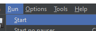

## Урок 9: Добавление слушателей и запуск тестов

### Цель
Цель этого урока - добавить слушателей для просмотра результатов теста и запустить сценарии тестирования в JMeter.

### Шаги

#### 9.1. Добавление слушателя
1. **Дерево результатов просмотра**
   - Щелкните правой кнопкой мыши на **Группе потоков**.
   - Выберите **Добавить > Слушатель > Дерево результатов просмотра**.

#### 9.2. Сохранение плана тестирования
1. **Сохранение**
   - Щелкните на узле **План тестирования**.
   - Перейдите в **Файл > Сохранить план тестирования как**.
   - Выберите местоположение, введите имя файла и сохраните план тестирования.

#### 9.3. Запуск сценария тестирования
1. **Выполнение**
   - Нажмите **Запуск > Старт**, чтобы начать тест.
      
   - Просматривайте результаты в слушателе **Дерево результатов просмотра**.
   - Убедитесь, что в результатах теста нет ошибок.

---

# [Далее: Выполнение нагрузочного тестирования](executing-load-testing.md)