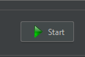

## Урок 3: Настройка и использование прокси-сервера

### Цель
Цель этого урока - настроить прокси-сервер в JMeter и продемонстрировать, как его использовать для записи HTTP(S) запросов.

### Шаги

#### 3.1. Настройка прокси-сервера
1. **Настройка порта и шаблонов URL**
   - В окне **HTTP(S) Test Script Recorder** установите значение поля **Порт** на `9090`.
   - В разделе **Шаблоны URL для исключения** нажмите **Добавить** и введите шаблоны, такие как `.*\.gif`, `.*\.js` и `.*\.css`.
      

#### 3.2. Запуск прокси-сервера
1. **Начало записи**
   - Нажмите кнопку **Старт** в нижней части окна **HTTP(S) Test Script Recorder**.
      

---

# [Далее: Запись и управление HTTP-запросами](recording-and-managing-http-requests.md)