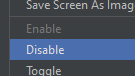
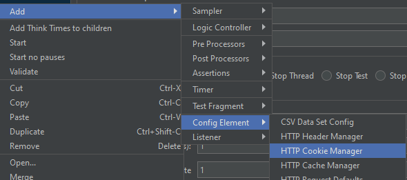

## Урок 6: Организация записанных запросов

### Цель
Цель этого урока - организовать записанные HTTP-запросы в JMeter для лучшего управления и выполнения тестов.

### Шаги

#### 6.1. Отключение Контроллера записи
1. **Отключение**
   - Щелкните правой кнопкой мыши на **Контроллере записи** в JMeter.
      
   - Выберите **Отключить**, чтобы прекратить захват дальнейших запросов.
      
#### 6.2. Добавление Менеджера HTTP Cookie
1. **Управление сессией**
   - Щелкните правой кнопкой мыши на **Группе потоков**.
      
   - Выберите **Добавить > Элемент конфигурации > Менеджер HTTP Cookie**.
      
---

# [Далее: Создание тестового сценария](creating-a-test-scenario.md)