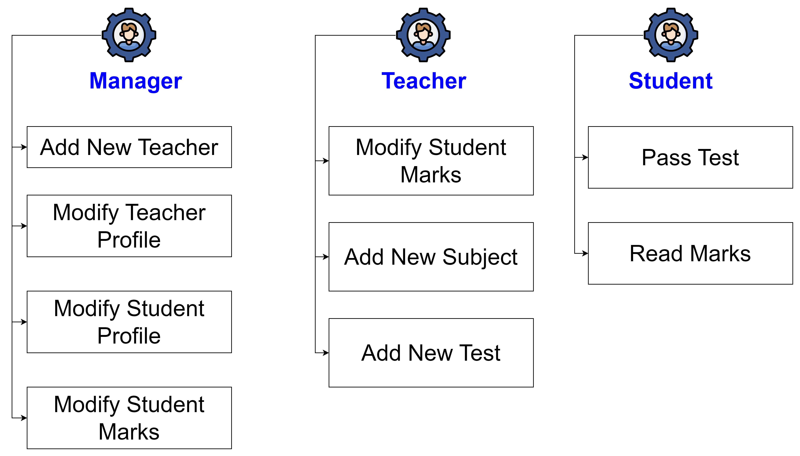

[English](../../en/springsecurity/lab-work.md) | [中文](../../cn/springsecurity/lab-work.md) | Русский

# Лабораторные работы по Spring Security

Добро пожаловать в лабораторные работы по Spring Security! Цель этой серии задач - помочь вам на практике познакомиться с Spring Security, а также создать почти полноценный проект. Если вы начинающий или просто стремитесь улучшить свои навыки, эти практические задачи помогут вам разобраться в различных аспектах интеграции безопасности в приложение на Spring.

## Цель лабораторных работ

Основная цель этих лабораторных работ - предоставить вам практический опыт и уверенность в использовании безопасности в среде Spring. Spring Security широко используется для аутентификации, авторизации и обеспечения безопасности вашего приложения, и через эти задачи вы получите полезные знания о конфигурации, аутентификации, авторизации и многом другом.

## Задачи практики 

1. [Задача 1: Настройка Spring Security](practice/configure-spring-security.md)
2. [Задача 2: Создание базовой реализации для пользователя](practice/base-implementation-user.md)
3. [Задача 3: Шифрование пароля](practice/password-encryption.md)
4. [Задача 4: Добавление фиктивных пользователей](practice/add-dummy-users.md)
5. [Задача 5: Создание идентификации для пользователей](practice/create-identity-to-users.md)
6. [Задача 6: Создание базы для авторизации на сервере](practice/setup-server-authorization.md)
7. [Задача 7: Авторизация аутентифицированных пользователей](practice/authorize-server-authenticated.md)
8. [Задача 8: Авторизация по ролям](practice/authorize-server-role.md)
9. [Задача 9: Авторизация по полномочиям](practice/authorize-server-authority.md)
10. [Задача 10: Настройка Thymeleaf Security](practice/configure-thymeleaf-security.md)
11. [Задача 11: Авторизация аутентифицированных пользователей](practice/authorize-client-authenticated.md)
12. [Задача 12: Авторизация по ролям](practice/authorize-client-role.md)
13. [Задача 13: Авторизация по полномочиям](practice/authorize-client-authority.md)
14. [Задача 14: Пользовательская форма входа](practice/custom-login-form.md)

## Задачи лабораторной работы 

### Задача 1: Настройка Spring Security
Инициализация Spring Security в вашем проекте.

### Задача 2: Определение Ролей и Полномочий Пользователей
Определение различных пользовательских ролей (Менеджер, Учитель, Студент) и их соответствующих полномочий.

### Задача 3: Настройка Безопасности в Контроллерах
Защита путей приложения (endpoins) с использованием контроля доступа на основе ролей.

#### Детали реализации
**Роль Менеджера**:
- Добавление Нового Учителя (`/teachers/new`)
- Изменение Профиля Учителя (`/teachers/{id}/edit`)
- Изменение Профиля Студента (`/students/{id}/edit`)
- Изменение Оценок Студента (`/students/{id}/marks/edit`)

**Роль Учителя**:
- Изменение Оценок Студента (`/students/{id}/marks/edit`)
- Добавление Нового Предмета (`/subjects/new`)
- Добавление Нового Теста (`/tests/new`)

**Роль Студента**:
- Прохождение Теста (`/tests/{id}/take`)
- Просмотр Оценок (`/students/{id}/marks`)

### Задача 4: Реализация Авторизации в Шаблонах Thymeleaf

Ограничение доступа к элементам пользовательского интерфейса на основе ролей пользователей.

### Задача 5: Тестирование Контроля Доступа на Основе Ролей
Убедитесь, что enpoints и элементы пользовательского интерфейса правильно защищены.
