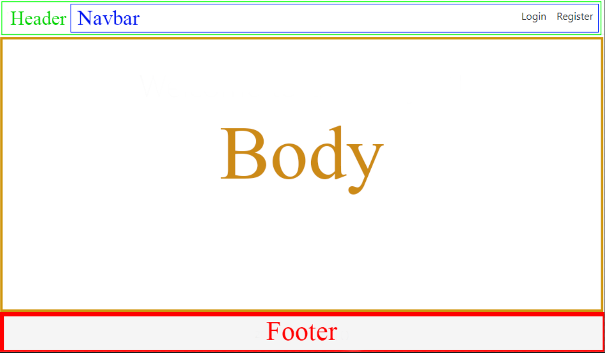
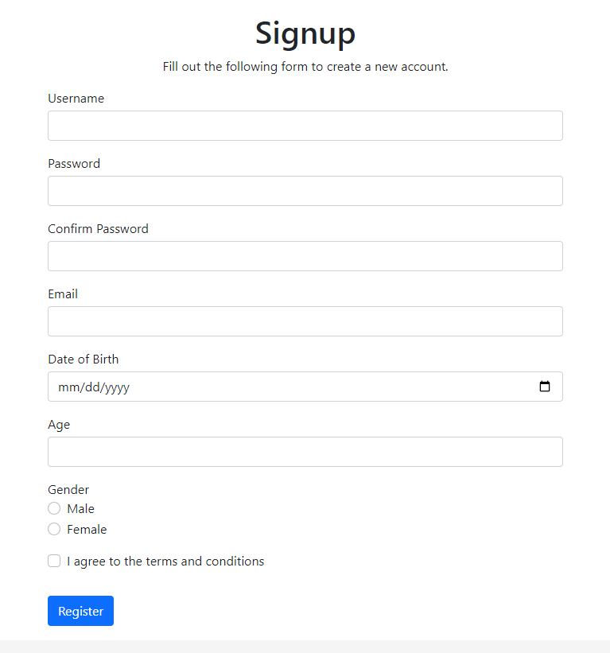

[English](../../en/thymeleaf/lab-work.md) | [中文](../../cn/thymeleaf/lab-work.md) | Русский

# Лабораторная работа по Thymeleaf

Добро пожаловать в лабораторную работу по Thymeleaf! Цель этой серии задач - помочь вам практиковаться и освоить Thymeleaf, мощный шаблонизатор для Java-приложений. Независимо от того, являетесь ли вы начинающим или стремитесь улучшить свои навыки, эти практические задачи научат вас различным аспектам интеграции Thymeleaf в приложение Spring.

## Цель лабораторной работы

Основная цель этой лабораторной работы - предоставить вам практический опыт и мастерство использования Thymeleaf в среде Spring. Thymeleaf широко используется для серверного рендеринга в веб-разработке, и через эти задачи вы получите ценные знания о его конфигурации, использовании переменных, контроллерах, обработке форм и многом другом.

## Практические задачи 

1. [Задача 1: Настройка Thymeleaf в Spring](practice/configure-thymeleaf.md)
2. [Задача 2: Создание первого представления](practice/create-first-view.md)
3. [Задача 3: Работа с переменными](practice/working-with-variables.md)
4. [Задача 4: Переменные и контроллер](practice/variables-and-controller.md)
5. [Задача 5: Итерация](practice/iteration.md)
6. [Задача 6: Литералы](practice/literals.md)
7. [Задача 7: Формы](practice/forms.md)
8. [Задача 8: Обработка форм](practice/form-handling.md)
9. [Задача 9: Query Parameter и валидация](practice/validation.md)
10. [Задача 10: Фрагменты и макеты](practice/fragments-and-layouts.md)

## Задачи лабораторной работы 

1. **Задача 1: Создание HTML-макета с фрагментами**

    - Создайте отдельные фрагменты для различных частей HTML-страницы, таких как навигационная панель, заголовок, head и подвал.
    - Соберите эти фрагменты в один HTML-файл, чтобы создать полный макет.
    - Например:
   
      

2. **Задача 2: Создание домашней страницы с локализацией**

    - Реализуйте домашнюю страницу, доступную по пути `/`.
    - Используйте созданный в Задаче 1 макет для структурирования домашней страницы.
    - Используйте выражения `#{}` для всего текстового содержимого на домашней странице, демонстрируя локализацию или сообщения из файла .properties.
    - Например:
   
      
   
3. **Задача 3: Создание форм входа и регистрации**

    - Разработайте и реализуйте формы входа и регистрации для аутентификации пользователей.
    - Используйте привязку модели Thymeleaf для обработки данных формы.
    - Например:
   
      

      
   
4. **Задача 4: Валидация действий входа и регистрации**

    - Реализуйте валидацию для действий входа и регистрации.
    - Используйте параметры запроса для передачи сообщений об ошибках в случае неудачной валидации.
    - Обеспечьте безопасное и правильное обращение с вводом пользователя.
    - Например:
   
      
   
5. **Задача 5: Создание страницы пользователей**

    - Разработайте страницу "Пользователи", отображающую таблицу пользователей.
    - Реализуйте итерацию для динамического заполнения таблицы данными пользователей.
    - Предоставьте функциональность удаления или изменения записей пользователя со страницы.
    - Например:
   
      
   
      

Не стесняйтесь исследовать и выполнять эти задачи в своем собственном темпе. Каждая задача разработана для дополнительного развития ваших навыков в Thymeleaf и веб-разработке. Если у вас есть вопросы или вам нужна помощь, не стесняйтесь обращаться.

Счастливого кодирования!