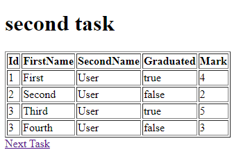

# Итерация

**Описание:**

В этом задании вы изучите концепцию итерации в Thymeleaf, создав класс `StudentModel` в пакете `models/` и заполнив список студентов в контроллере `PracticeController`. Целью является передача списка студентов в представление `secondView` и отображение таблицы с данными студентов.

**Шаги:**

1. **Создайте класс StudentModel:**
   - В пакете `models/` создайте класс `StudentModel` со следующими атрибутами:

   ```java
   public class StudentModel {
       private Integer id = 0;
       private String firstName = "";
       private String sureName = "";
       private Boolean isGraduated = false;
       private Integer mark = 0;
   
       // Конструктор, геттеры и сеттеры
   }
   ```

2. **Заполните список студентов в контроллере PracticeController:**
   - В классе `PracticeController` создайте список `StudentModel` и заполните его фиктивными данными студентов:

   ```java
   @Controller
   public class PracticeController {
       private final List<StudentModel> students = new ArrayList<>();
   
       public PracticeController() {
           // Заполните список пользователями
           this.students.add(new StudentModel(1, "First", "User", true, 4));
           this.students.add(new StudentModel(2, "Second", "User", false, 2));
           this.students.add(new StudentModel(3, "Third", "User", true, 5));
           this.students.add(new StudentModel(4, "Fourth", "User", false, 3));
       }
   
       // Остальные методы контроллера
   }
   ```

3. **Передайте студентов в secondView:**
   - В методе `secondView` контроллера `PracticeController` добавьте список студентов в модель.

   ```java
   @Controller
   public class PracticeController {
       // Остальные методы...
   
       @GetMapping("/second")
       public String secondView(Model model) {
           // Передайте список студентов в представление
           model.addAttribute("students", students);
           // Остальная часть метода...
       }
   }
   ```

4. **Отобразите таблицу студентов в second.html:**
   - Откройте файл представления Thymeleaf `second.html`.

5. **Отобразите заголовок таблицы:**
   - Добавьте раздел заголовка таблицы внутри тега `<thead>`:

   ```html
   <table border="1">
       <thead>
       <tr>
           <th>Id</th>
           <th>FirstName</th>
           <th>sureName</th>
           <th>Graduated</th>
           <th>Mark</th>
       </tr>
       </thead>
       <!-- Остальная часть таблицы... -->
   </table>
   ```

6. **Отобразите тело таблицы с использованием итерации:**
   - Добавьте раздел тела таблицы внутри тега `<tbody>` и выполните итерацию по списку студентов для отображения каждой строки:

   ```html
   <tbody>
       <!-- Выполните итерацию по списку студентов и отобразите каждую строку -->
       <tr th:each="student : ${students}">
           <td th:text="${student.id}"></td>
           <td th:text="${student.firstName}"></td>
           <td th:text="${student.sureName}"></td>
           <td th:text="${student.isGraduated}"></td>
           <td th:text="${student.mark}"></td>
       </tr>
   </tbody>
   ```

## Результат
Ваша страница должна выглядеть так:



**Заключение:**

Вы успешно реализовали итерацию в Thymeleaf, создав список объектов `StudentModel`, передав его в `secondView` и отображая таблицу студентов в представлении `second.html`. Этот подход позволяет динамически отображать данные в таблицах на основе предоставленной модели.

# [СЛЕДУЮЩЕЕ ЗАДАНИЕ: *Литералы*](literals.md)
