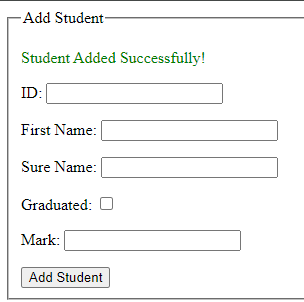

# Запросы и валидация

**Описание:**

В этом продолжении мы рассмотрим использование параметров запроса для отображения сообщений в представлении после обработки отправленных форм. Это включает в себя адаптацию `thirdView` для отображения сообщений об успешном выполнении и сообщений об ошибках на основе параметров запроса.

**Шаги:**

1. **Адаптация представления (thirdView.html):**

   - Откройте файл `third.html` и добавьте секции для отображения сообщений об успехе и ошибок:

     ```html
     <!DOCTYPE html>
     <html lang="en" xmlns:th="http://www.thymeleaf.org">
     <head>
         <!-- Остальные элементы head... -->
     </head>
     <body>
         <!-- Остальные элементы body... -->

         <div th:if="${param.addedStudent}">
             <p style="color: green;">Студент успешно добавлен!</p>
         </div>

         <div th:if="${param.error}">
             <p style="color: red;">Ошибка: <strong th:text="${param.error}"></strong></p>
         </div>

         <!-- Остальное содержимое... -->
     </body>
     </html>
     ```

   - Объяснение:
      - `<div th:if="${param.error}">` проверяет, присутствует ли параметр запроса `error` в URL.
      - Если параметр присутствует, отображается сообщение об ошибке красного цвета, полученное из `${param.error}`.

2. **Обработка отправки формы с дополнительной валидацией (PracticeController):**

   - Обновите метод `addStudent` в `PracticeController` для включения дополнительной валидации оценки студента с использованием структуры `if-else`:

     ```java
     import org.springframework.stereotype.Controller;
     import org.springframework.ui.Model;
     import org.springframework.web.bind.annotation.*;

     import java.util.ArrayList;
     import java.util.List;

     @Controller
     public class PracticeController {

         private final List<StudentModel> students = new ArrayList<>();

         // Остальные методы...

         @PostMapping("/addStudent")
         public String addStudent(@ModelAttribute("model") StudentModel model) {
             // Дополнительная валидация: Проверка, что оценка не более 5.
             if (model.getMark() > 5) {
                 // Если оценка больше 5, выполняется перенаправление с сообщением об ошибке.
                 return "redirect:/third?error=Оценка не должна быть более 5";
             } else {
                 students.add(model);

                 return "redirect:/third?addedStudent=true";
             }
         }
     }
     ```

## Результат
Ваша страница должна выглядеть так:




**Заключение:**

Вы успешно адаптировали `third` для отображения сообщений об успехе и сообщений об ошибках на основе параметров запроса. Это предоставляет более полный механизм обратной связи для пользователей, взаимодействующих с формой.

# [СЛЕДУЮЩЕЕ ЗАДАНИЕ: *Фрагменты и макеты*](fragments-and-layouts.md)
